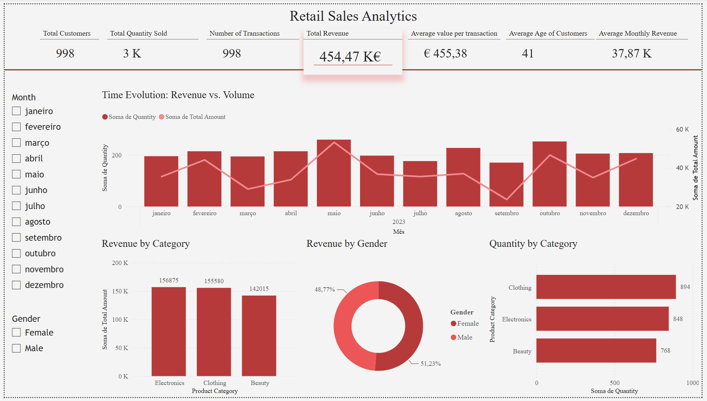
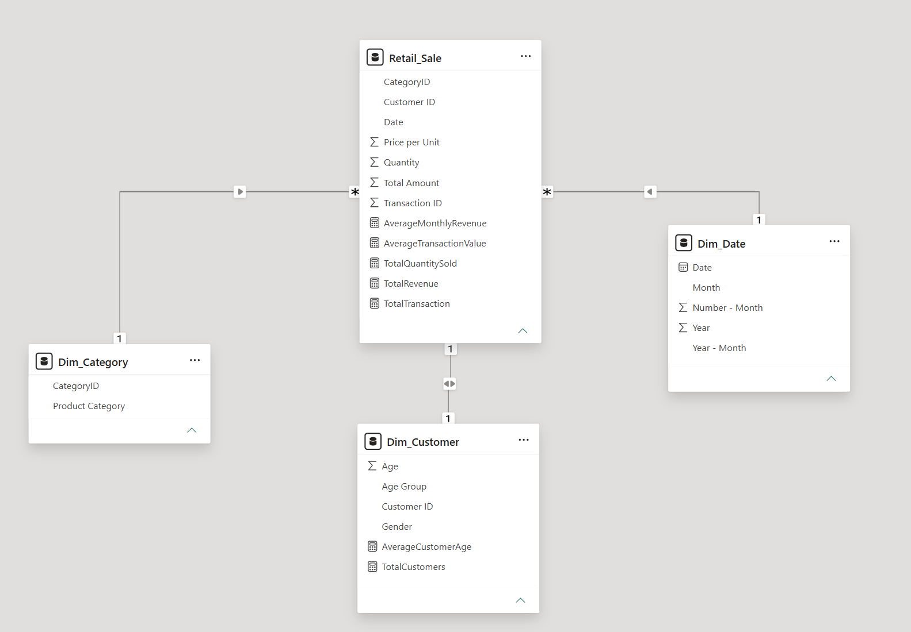
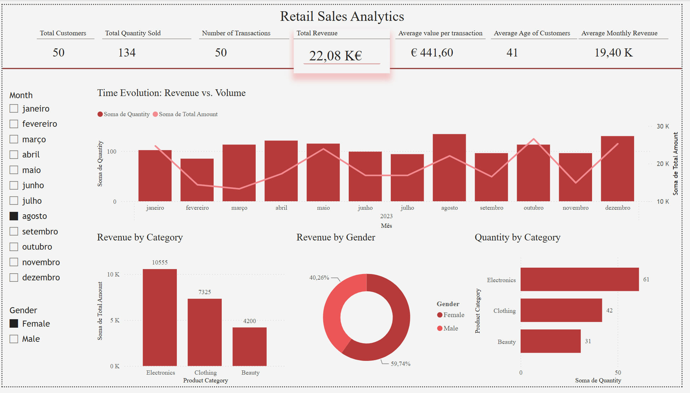

# Retail Sales Analytics

### Project Highlights

\- 1,000 retail transactions analyzed

\- Data cleaning and quality assessment using Python

\- Exploratory Data Analysis using Pandas, Matplotlib and Seaborn

\- Star-schema data model developed in Power BI

\- DAX measures and KPIs

\- Interactive Power BI dashboard with filters

\- Business insights derived from sales, customer and temporal analysis

##### Project Overview

This project is a first small portfolio project developed to build practical

skills in the Data Analytics field. It focuses on the analysis of retail sales

data, exploring sales performance, product categories, customer characteristics,

and temporal trends.

The project combines data preparation and exploratory analysis in Python with

data modeling, KPI development, DAX measures, and interactive dashboard

creation in Power BI.

&#x09;The objective was to explore:

\- Overall sales performance

\- Performance of product categories

\- Demographic data and customer consumption patterns

In order to:

\- Identify temporal sales trends

\- Compare revenue and sales volume

\- Develop an interactive dashboard in Power BI

\- Extract actionable business insights

##### Business Questions

The following business questions were defined to guide the analysis and

maintain a clear focus based on the available data:

1\. Which product categories generate the most revenue?

2\. Which categories have the highest sales volume?

3\. How does customer spending vary by gender and age group?

4\. How does revenue evolve over time?

5\. Are changes in revenue associated with changes in sales volume?

##### Dataset

The database named Retail Sales Dataset, available on Kaggle, is composed of 1,000 retail transactions and includes information about:

\- Transaction ID

\- Date

\- Customer ID

\- Gender

\- Age

\- Product Category

\- Quantity

\- Price per Unit

\- Total Amount

##### Tools \& Technologies

###### 

###### Python

&#x20; - Pandas

&#x20; - NumPy

&#x20; - Matplotlib

&#x20; - Seaborn

###### Power BI

&#x20; - Power Query

&#x20; - Data Modelling

&#x20; - DAX

&#x20; - Interactive Visualizations

###### GitHub

##### Workflow

1. Direct data upload from Kaggle
2. Data quality assessment
3. Data cleaning and preparation
4. Exploratory data analysis
5. Identification of business insights
6. Data modeling in Power BI
7. Development of KPIs and DAX metrics
8. Development of interactive dashboards
9. Results and conclusions

##### PowerBI Dashboard

###### Dashboard Overview

###### Data Model

###### Dashboard Interaction

###### Results \& Conclusions

While electronics generate the highest total revenue, clothing has the highest sales volume of units sold. The biggest buyers are customers aged 25-34 for clothing and 55-64 for electronics. Despite this, the largest number of customers are in the 45-54 age group.

With female customers being the majority in the dataset, 20 more than male customers, they are the ones who consume the most and have a higher total revenue, with no great distinction between categories. In addition, they have a higher transaction value than male customers, with an average transaction value of €456. But by age group distribution, we can see that both women and men spend more per transaction in the 18-24 age group and less in the predominant age groups (45-54, 55-64), with women aged 45-54 having the lowest transaction value.

In the temporal analysis, a sales peak was observed in May, resulting in total revenue exceeding €50,000, followed by a sharp drop in August. From September to October, there was again a sharp increase, followed by a slight drop, and then a rise again in December. Regarding the quantity sold, the decrease from October to November continues, but there is no increase from November to December, with a slight rise, almost remaining the same.

The analysis demonstrates how combining sales volume, revenue, customer characteristics, and temporal information can provide a more complete view of retail performance and support business-oriented decision making.

